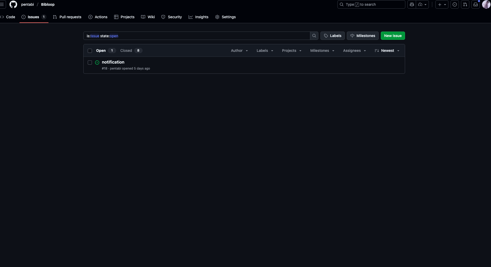
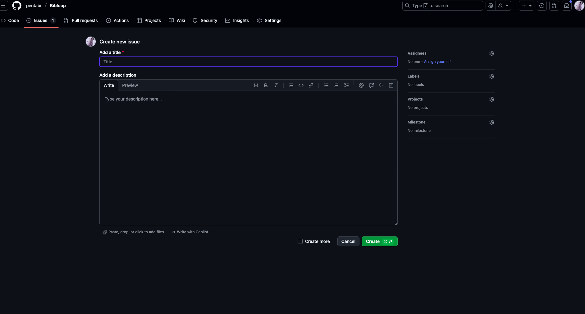
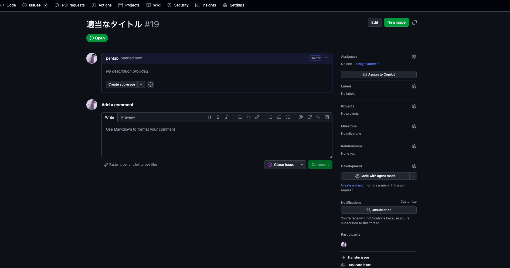
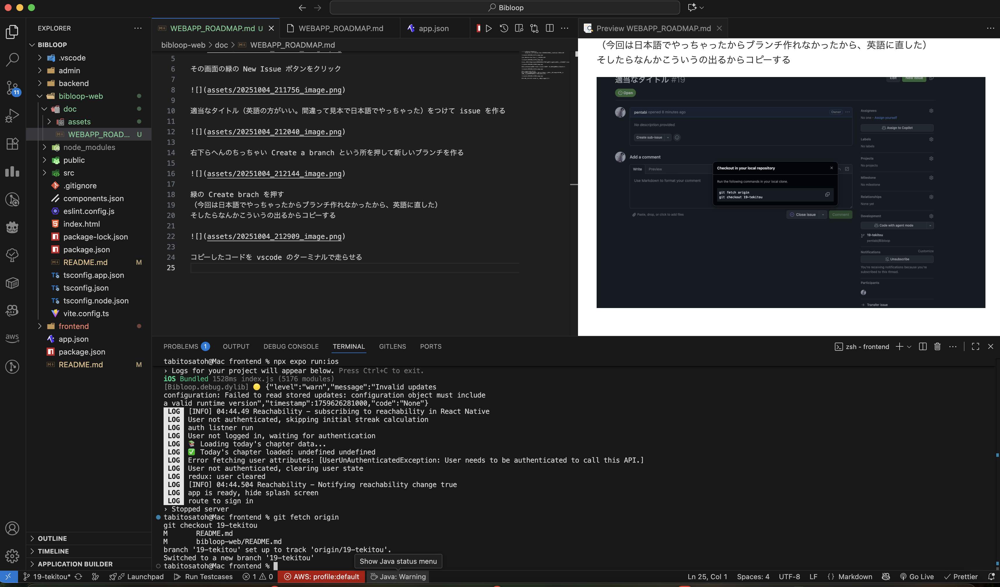

#　目当て
自分のブランチ作って、それをマージする方法を教えるよ。
何か新しい機能とかを作るとき、これを毎回するよ。

# 自分のブランチの作り方

Github に行って Bibloop のプロジェクトを開いた後、Issues をクリック

その画面の緑の New Issue ボタンをクリック

適当なタイトルをつけて issue を作る

右下らへんのちっちゃい Create a branch という所を押して新しいブランチを作る

緑の Create brach を押す
そしたらなんかこういうの出るからコピーする
（もし間違えて閉じちゃったら、vscode 右下の main という所を押して今自分が作ったブランチに移動する。ちょっと更新するまで時間かかるから待たなきゃ自分のブランチが表示されないかも。）

コピーしたコードを vscode のターミナルで走らせる

そしたら右下の表示が自分のつけた名前に変わるから、ここなら何してもいい。

それで、いろいろ編集したり機能追加したら、、、

# プルリクエストの作り方

Github に戻って PullRequest を開く

緑の New Pull request を押す
違う画面に移動したら、左上の base っていう所は main であることを確認して、右の compare は自分のブランチを選択、緑の create pull request ボタンを選択

もう一回 create pull request 押す

右に Reviewers っていうところがあるから、僕の Pentabi っていうアカウントの横の青い「request」ボタンを押す。（僕は本人だから自分の名前が出てない）

Merge pull request の緑のボタンは押さない。
これで放置して、あとで僕が変更みて merge する！
なるほど。理解しました。今学期時間ありそうだからやってみるね！！
