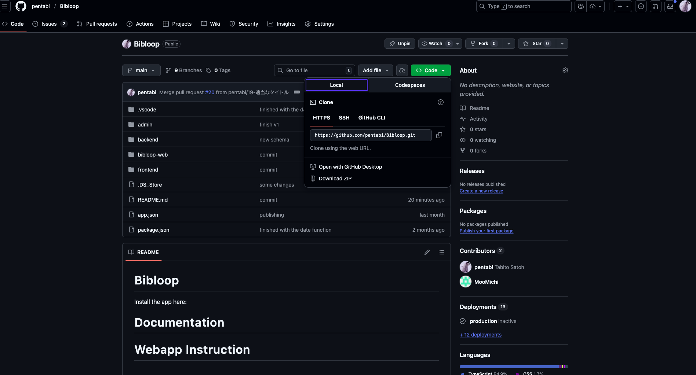

#　クローン
https://github.com/pentabi/Bibloop
にいく

緑の Code っていう所押す。


HTTPS のリンクをコピーする

vscode で自分がプロジェクトのフォルダーを作りたいダイレクトリー（ファイル）を開く

Terminal で

```bash
git -clone <今コピーしたやつ>
```

を走らせればクローン完了（<>マークは不要だよ、けどよくこういう系の説明で使われるから今回使ったよ）
