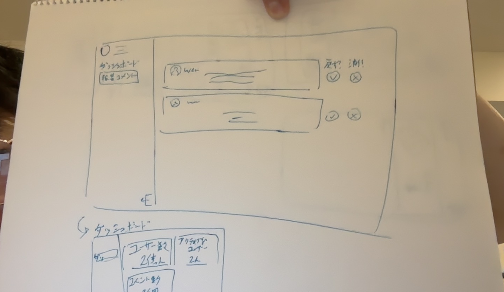

# 目的

アプリの情報を見たり、今日の聖書の箇所を決めたりできるアドミンのウェブサイトを作る

## 機能

- 聖書の箇所選択機能（何日にどの箇所やるかとか）
- ユーザー情報表示機能　（活発なユーザーはどれくらいいるか、何人がアプリをインストールしているか、などなど）
- 報告されたコメント査定機能（報告されたコメントを戻すか、非表示にするか）
- ニュース（？）

僕の素晴らしいスケッチ：

