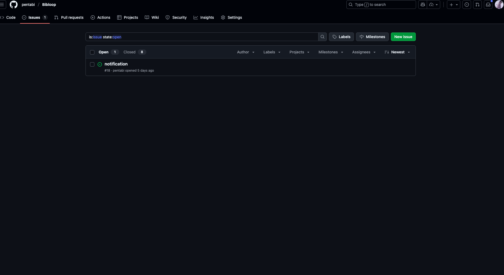
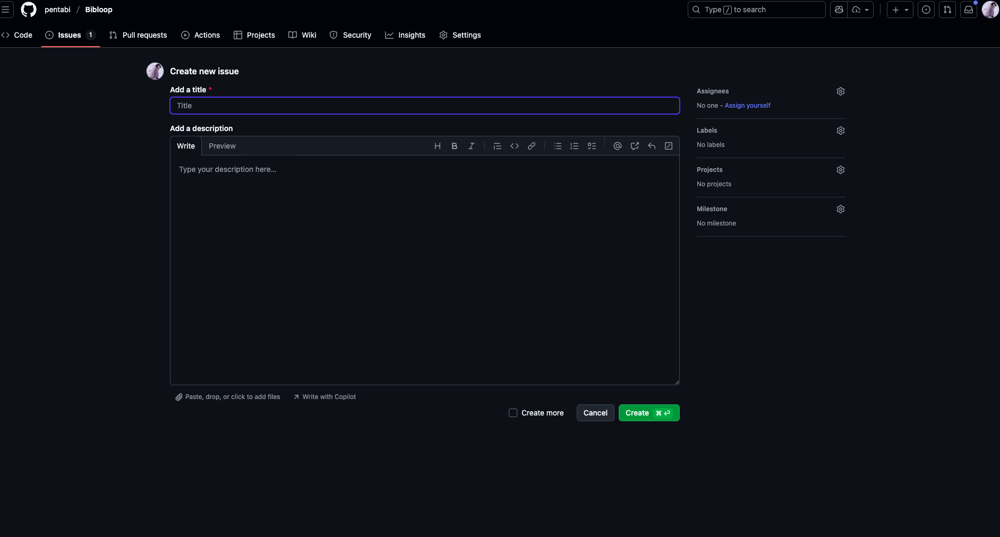
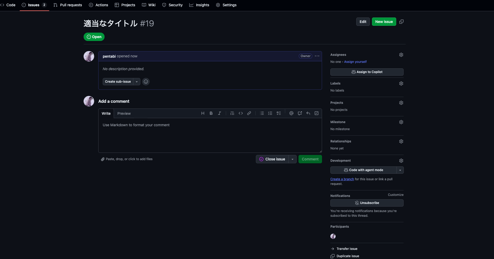
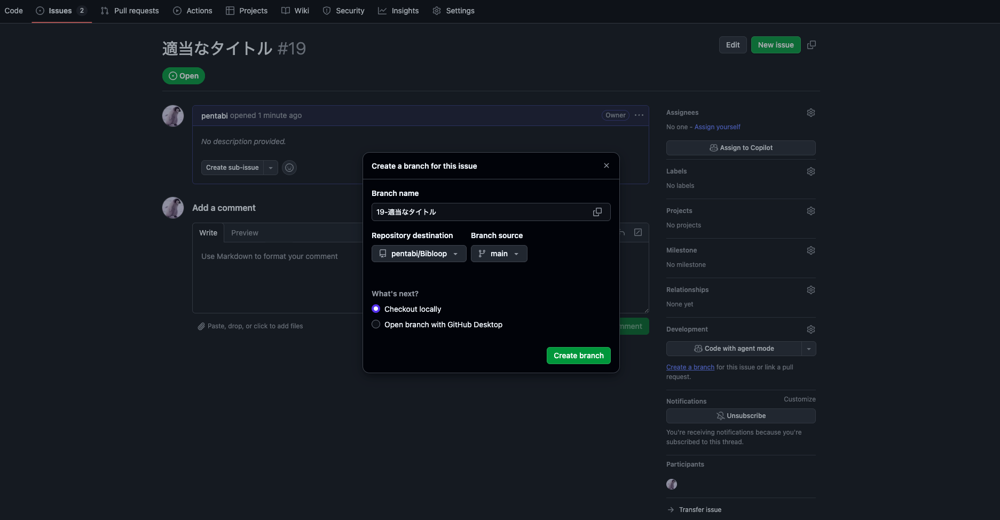
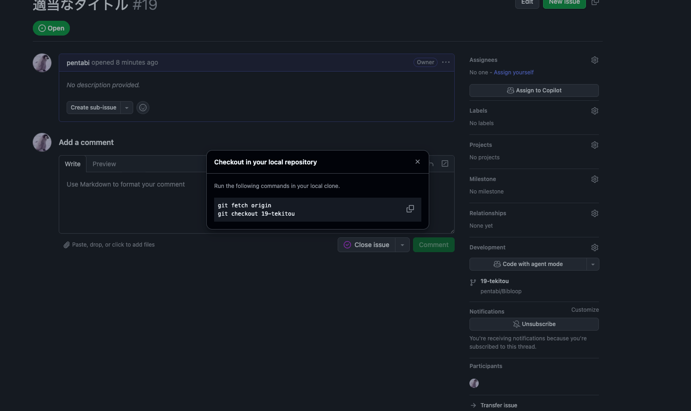
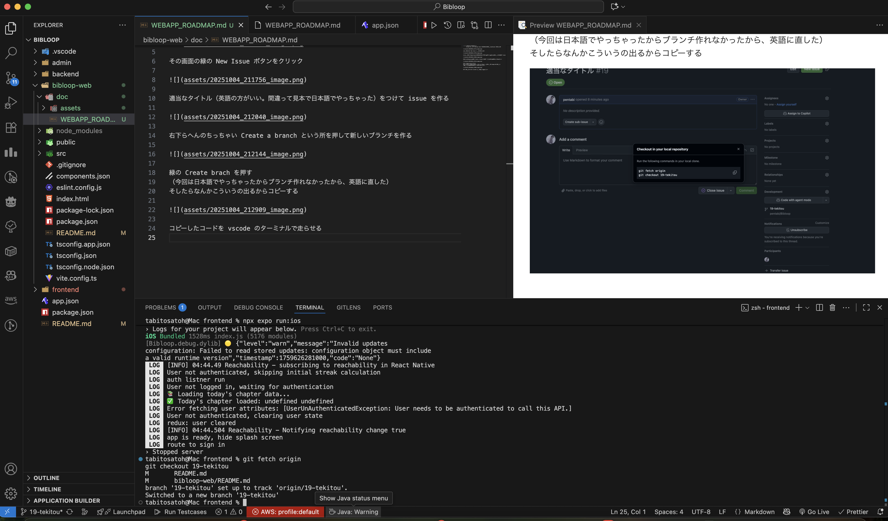
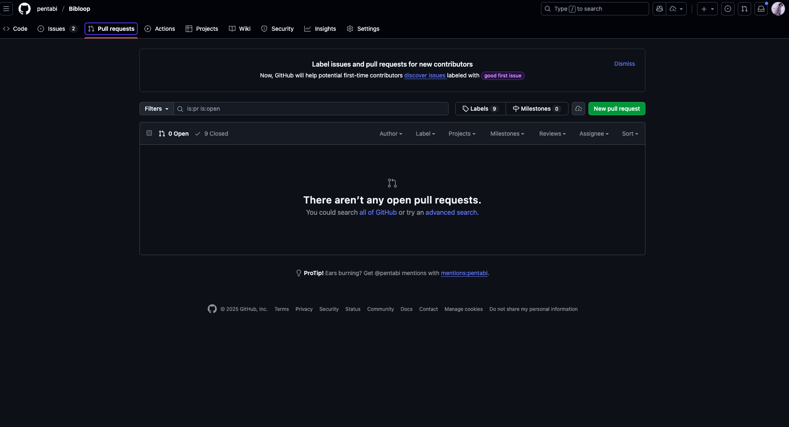

- [ ] 自分のブランチを作る
      Github に行って Bibloop のプロジェクトを開いた後、Issues をクリック

その画面の緑の New Issue ボタンをクリック

適当なタイトルをつけて issue を作る

右下らへんのちっちゃい Create a branch という所を押して新しいブランチを作る

緑の Create brach を押す
そしたらなんかこういうの出るからコピーする
（もし間違えて閉じちゃったら、vscode 右下の main という所を押して今自分が作ったブランチに移動する。ちょっと更新するまで時間かかるから待たなきゃ自分のブランチが表示されないかも。）

コピーしたコードを vscode のターミナルで走らせる

そしたら右下の表示が自分のつけた名前に変わるから、ここなら何してもいい。

それで、いろいろ編集したり機能追加したら、、、

Github に戻って PullRequest を開く

緑の New Pull request を押す
